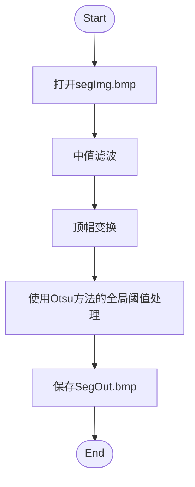
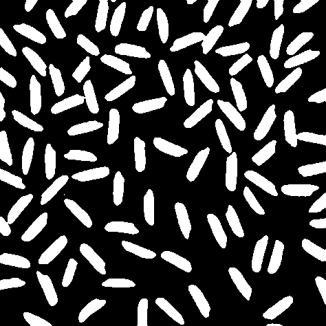

# 图像分割实验

## 实验算法设计

算法分为三步：

1. 中值滤波器
2. 对图像进行顶帽变换
3. 使用Otsu方法的全局阈值处理

### 流程图

### 1. 中值滤波器

使用$3 \times 3$的窗口进行中值滤波
选择每一个像素临近的8个点，加上像素本身，$g(x,\ y)=$中位数。

### 2. 顶帽变换

1. 腐蚀图像 $g_1=f\ominus b$, $b$取半径30的圆
2. 开操作：对腐蚀后的图像膨胀$g_2=g\circ b = g_1\oplus b$
3. 顶帽变换：$g=f-g_2$

### 2. 使用Otsu方法的全局阈值处理

1. 先计算归一化直方图$p_i,\ i=1,2,\dots, L-1,\ L$是灰度级数
2. 对于$k=1,2,\dots, L-1$，计算归一化累计直方图$P_1(k)$
3. 对于$k=1,2,\dots, L-1$，计算累计均值$m(k),\ m(k)=\sum_{i=0}^k{ip_i}$
4. 计算全局灰度均值$m_G=m(L-1)$
5. 对于$k=1,2,\dots, L-1$，计算类间方差$\sigma^2_B(k)=\frac{(m_GP_1-m)^2}{P_1(1-P_1)}$
6. $\sigma^2_B$的各最大值对应的$k$的平均值就是Otsu阈值$k^*$
7. 分割图像

$$
g(x,\ y)=
\begin{cases}
    1,&&f(x,\ y)>k^*\\
    0, &&f(x,\ y)\le k^*
\end{cases}
$$

## 结果

### 分割结果

### 包含参数

* `radius=30`：顶帽变换所使用的圆的半径
* `L=256`：灰度级数

## 待改进

膨胀和腐蚀所需的时间较长。
