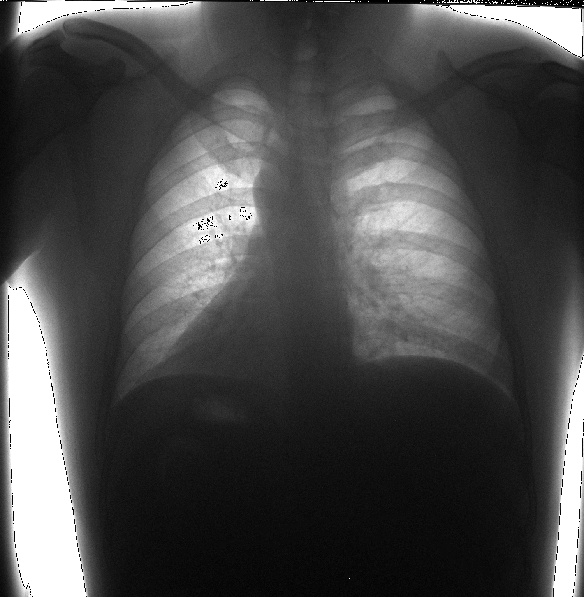

# 实验 3 图像锐化

## 实验目的

理解 unsharp masking 算法的实现步骤，并直观了解图像锐化处理的效果。

## 算法: 使用二阶微分进行图像锐化

将二阶微分定义为如下差分：
$$
   \dfrac{\partial^2f}{\partial x^2} = f(x+1) + f(x-1) - 2f(x) \tag{1}
$$

二维图像函数$f(x,y)$拉普拉斯算子的定义为：

$$
    \nabla^2f = \dfrac{\partial^2f}{\partial x^2} + \dfrac{\partial^2f}{\partial y^2}
    \tag2
$$

将(1)式代入得：

$$
    \nabla^2f(x,y)=f(x+1,y) + f(x-1,y)\\ + f(x,y+1) + f(x,y-1)-4f(x,y)
    \tag3
$$

$\therefore$滤波器模版为：

$$
    \begin{pmatrix}  
    0 & 1 & 0 \\
    1 & -4 & 1 \\
    0 & 1 & 0
    \end{pmatrix}
$$

输出：
$$
    g(x,y) = f(x,y)-\nabla^2f(x,y)
$$

## 实验结果

### 输入图像

### 输出图像

### 结论

输出图像细节较清晰，有过冲现象。
